

| 正式版                                                                                                                                                                          | 测试版                                                                                                                                                                                     | 讨论群                                                                                                                                                                                                                                                                                                                                                                                                           |
|------------------------------------------------------------------------------------------------------------------------------------------------------------------------------|-----------------------------------------------------------------------------------------------------------------------------------------------------------------------------------------|---------------------------------------------------------------------------------------------------------------------------------------------------------------------------------------------------------------------------------------------------------------------------------------------------------------------------------------------------------------------------------------------------------------|
|  |  |  |

[Bangumi]: http://bangumi.tv

[Compose Multiplatform]: https://www.jetbrains.com/compose-multiplatform/

[Ikaros]: https://ikaros.run/

[Kotlin Multiplatform]: https://kotlinlang.org/docs/multiplatform.html

[ExoPlayer]: https://developer.android.com/media/media3/exoplayer

[VLC]: https://www.videolan.org/vlc/

Wynime 支持云同步观看记录 ([Bangumi][Bangumi])、多视频数据源、缓存以及更多功能，提供尽可能简单且舒适的追番体验。

[立即下载](https://github.com/william12233/Wynime)

https://github.com/user-attachments/assets/e63636c9-30b7-411c-aa6b-e5b78b900726

## 主要功能

### 浏览来自 [Bangumi][Bangumi] 的番剧信息以及社区评价

|  |  | 
|:---------------------------------------------------------------------------:|:--------------------------------------------------------------------------:|

### 丰富的检索方式：新番时间表、标签搜索

> 新番時間表與季番資料由 Bangumi 提供。

| 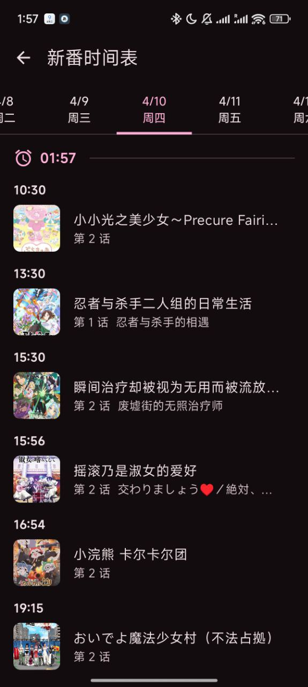 | 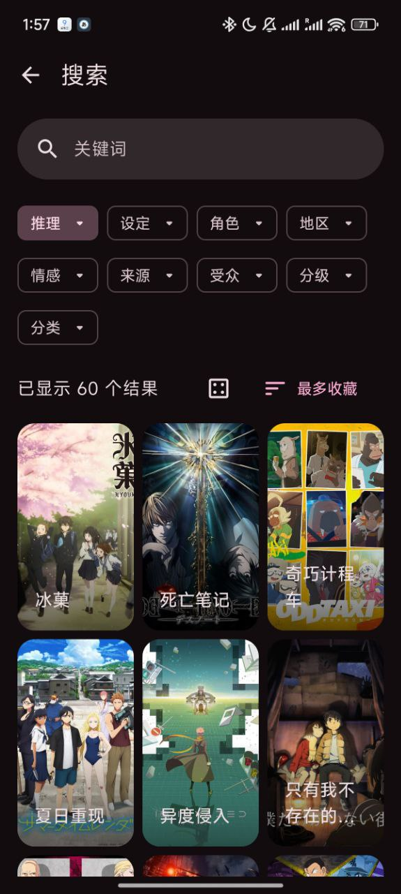 | 
|:--------------------------------------------------------------------------:|:-------------------------------------------------------------------------:|

### 云同步追番进度

- 省心的追番进度管理，看完视频自动更新进度
- 打开 APP 立即继续观看，无需回想上次看到了哪

| 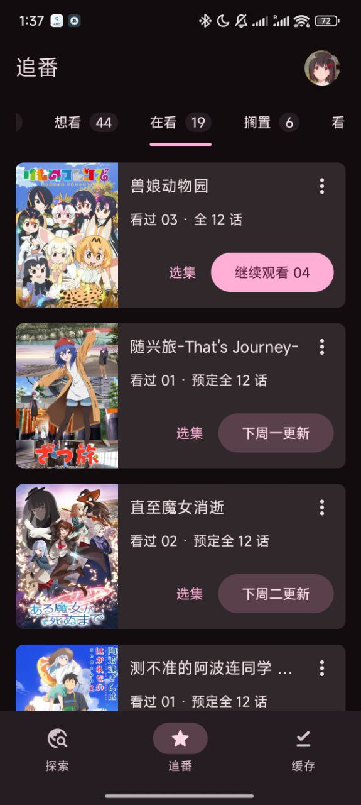 | 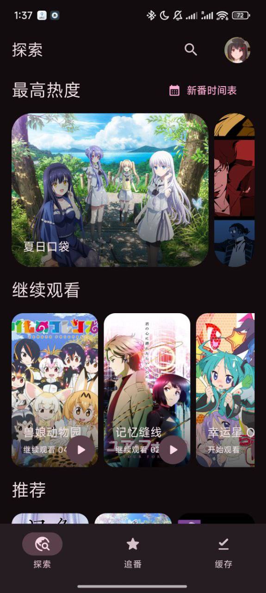 | 
|:------------------------------------------------------------------------------:|:----------------------------------------------------------------:|

### 聚合数据源

- [來源外掛](source/plugins)，依實際線路與媒體要求自動選擇
  > 还支持 Jellyfin、Emby、以及自定义源

| 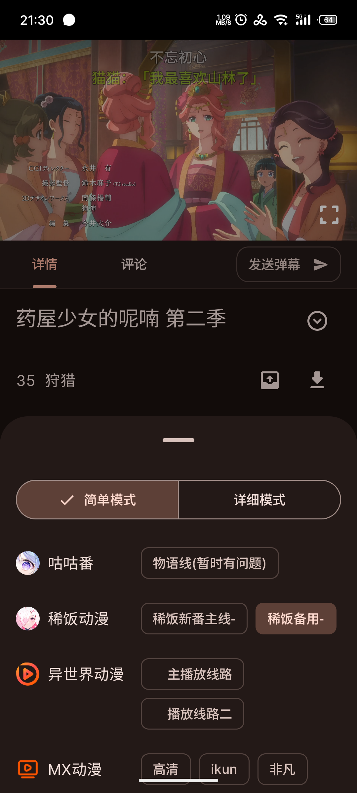 | 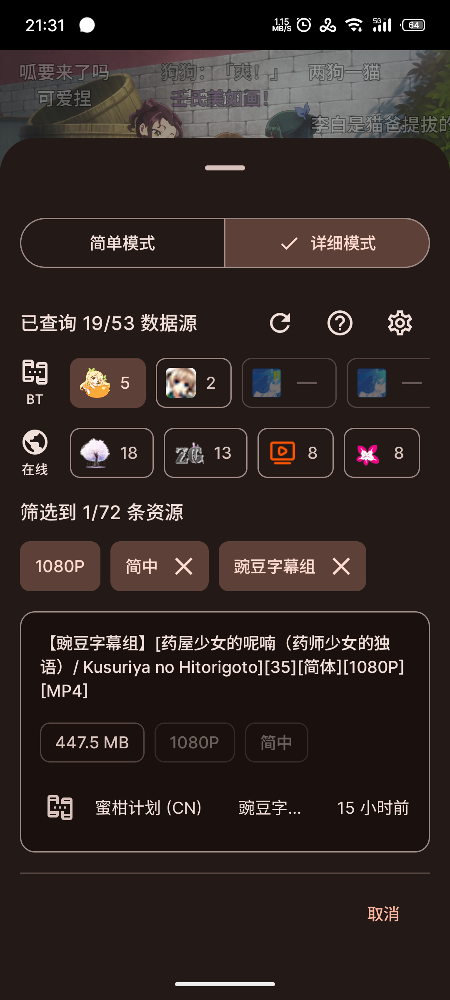 |
|:--------------------------------------------------------------------------------:|:----------------------------------------------------------------------------------:|

|  | 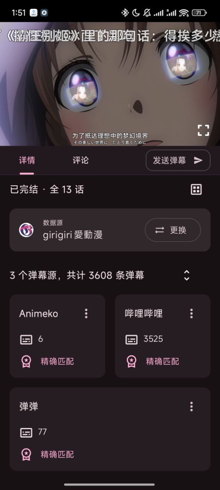 |
|:-------------------------------------------------------------------:|:----------------------------------------------------------------------------:|

### 离线缓存

- 所有数据源都能缓存

| 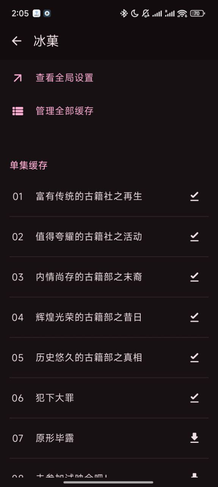 | 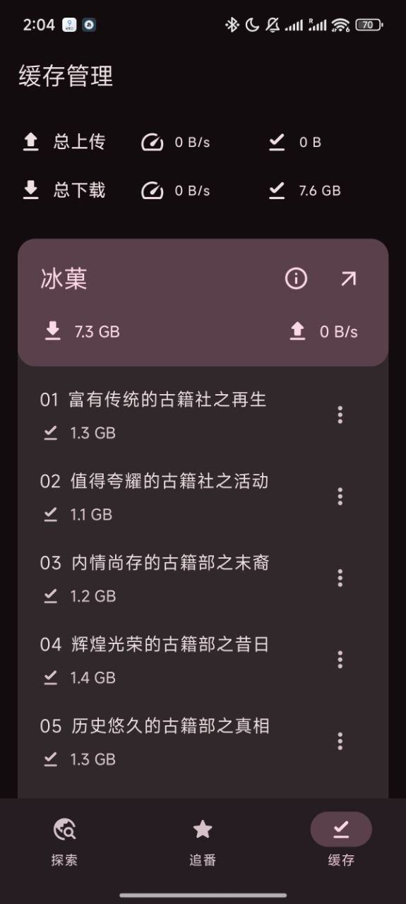 |
|:-------------------------------------------------------------------------:|:----------------------------------------------------------------------:|

### 精美界面

|  |
|:-----------------------------------------------------------------------------:|

- 适配平板和大屏设备

| 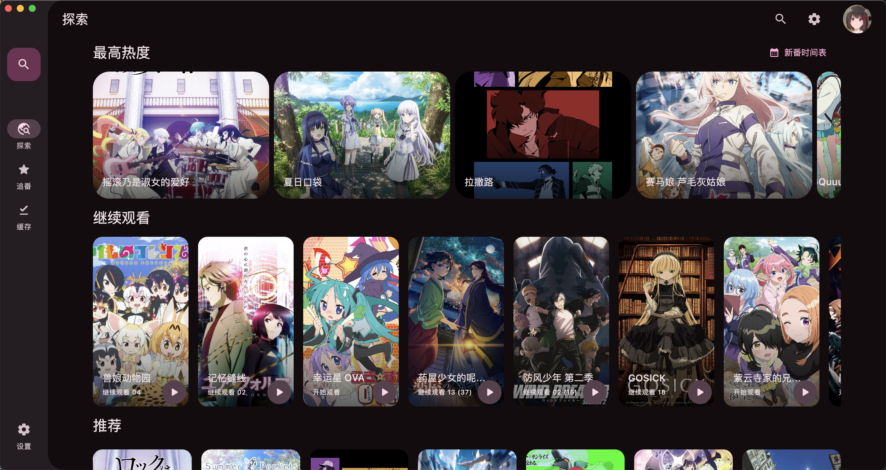 |
|:-------------------------------------------------------------------:|

| 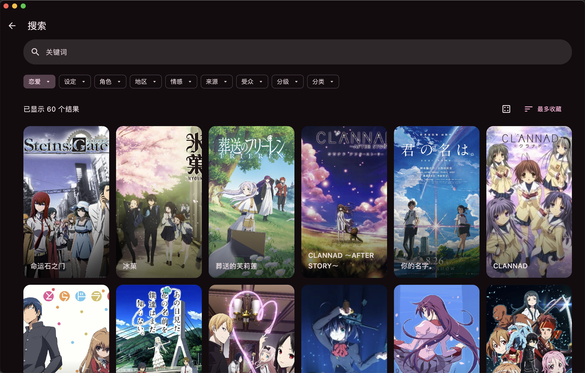 |
|:---------------------------------------------------------------------:|

| 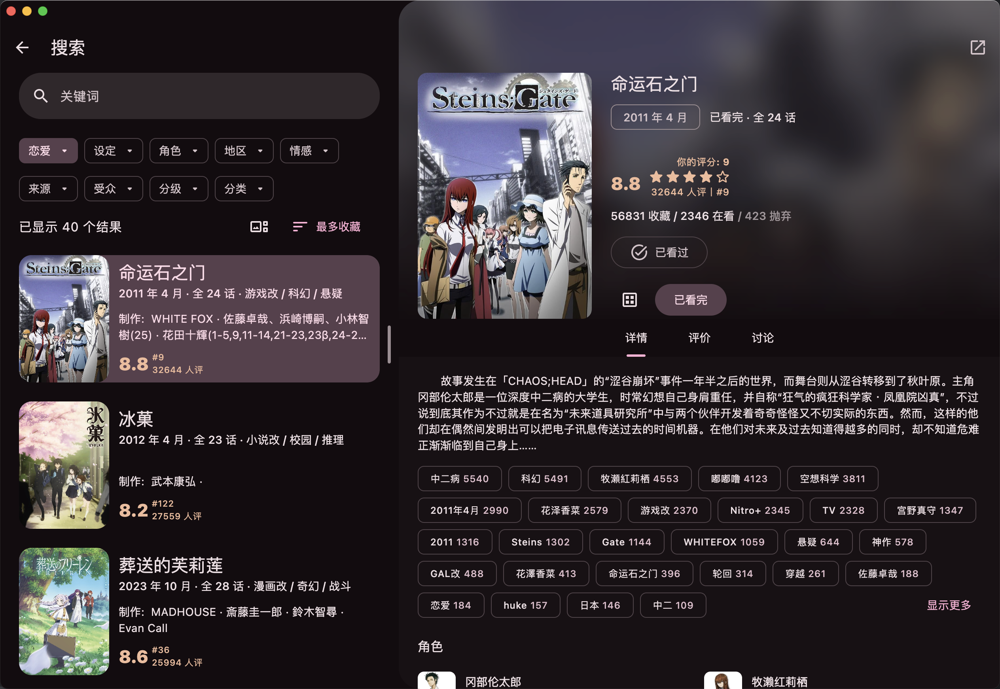 |
|:----------------------------------------------------------------------------:|

### 更多個性設定

| 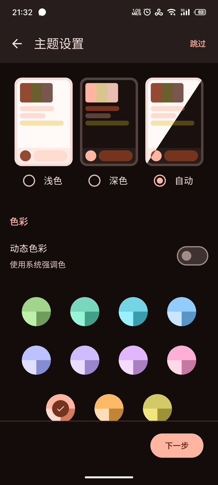 |  |
|:--------------------------------------------------------------------------:|:-----------------------------------------------------------------------------:|

## 下载

Wynime 支援 Android 手機／平板及 Windows。

- 稳定版本: 功能稳定  
  [下载稳定版本](https://github.com/william12233/Wynime/releases)

通常建议使用稳定版本. 如果你愿意参与测试并拥有一定的对 bug 的处理能力, 也欢迎使用测试版本更快体验新功能.
具体版本类型可查看下方.

- 测试版本: 体验最新功能  
  [下载测试版本](https://github.com/william12233/Wynime/releases)

## 技术总览

如果你是开发者，我们总是欢迎你提交 PR 参与开发！
以下几点可以给你一个技术上的大概了解。

- [Kotlin 多平台][Kotlin Multiplatform]架构；
- 使用新一代响应式 UI 框架 [Compose Multiplatform][Compose Multiplatform] 构建
  UI；
- 使用 [Mediamp](https://github.com/open-ani/mediamp)，Android 以 [ExoPlayer][ExoPlayer] 播放，Windows 使用 mpv／FFmpeg；
- 多类型在线数据源适配，拥有强大的自定义数据源编辑器和自动数据源选择器。

### 参与开发

欢迎你提交 PR 参与开发，
有关项目技术细节请参考 [CONTRIBUTING](docs/contributing/README.md)。

## FAQ

### 资源来源是什么?

全部视频数据都来自网络, Wynime 本身不存储任何视频数据。
Wynime 使用可安裝的 [v3 來源外掛](source/plugins)，附帶七個來源的 Android Dex 與 Windows JVM 套件。來源網站提供媒體，App 負責搜尋、選擇、播放及下載。
