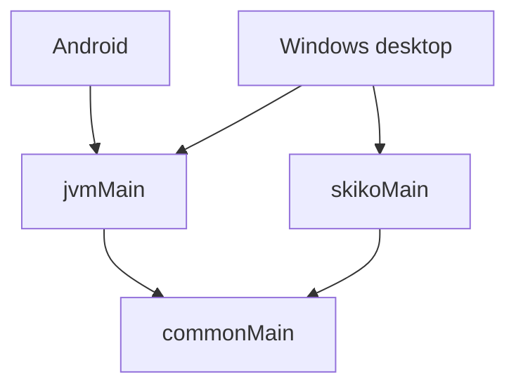

# Kotlin 多平台

Wynime 使用 Kotlin Multiplatform，編譯目標為 Android 與桌面 JVM。桌面入口、原生函式庫及 distributable 支援 Windows。

`commonMain` 提供跨平台資料與業務邏輯；`jvmMain` 分享 Android 與 Windows 可用的 JVM 實作；`androidMain` 與 `desktopMain` 提供平台 actual 實作。

`skikoMain` 是桌面 Compose 的輔助源集。`mobileMain` 與 `androidMain` 的共用關係由 convention 定義。共享源集本身不表示額外的受支援平台。

Gradle convention 使用 `wynime.*` 名稱，位於 `build-logic`。測試源集以同一分層區分 common、JVM、桌面、Android host 與 Android device 測試。

自有 Kotlin package 使用 `com.wynime.*`。持久化 JSON discriminator、舊登入回呼、資料庫檔名及 Windows 資料目錄維持相容識別；這些字串不作一般 package 更名。
